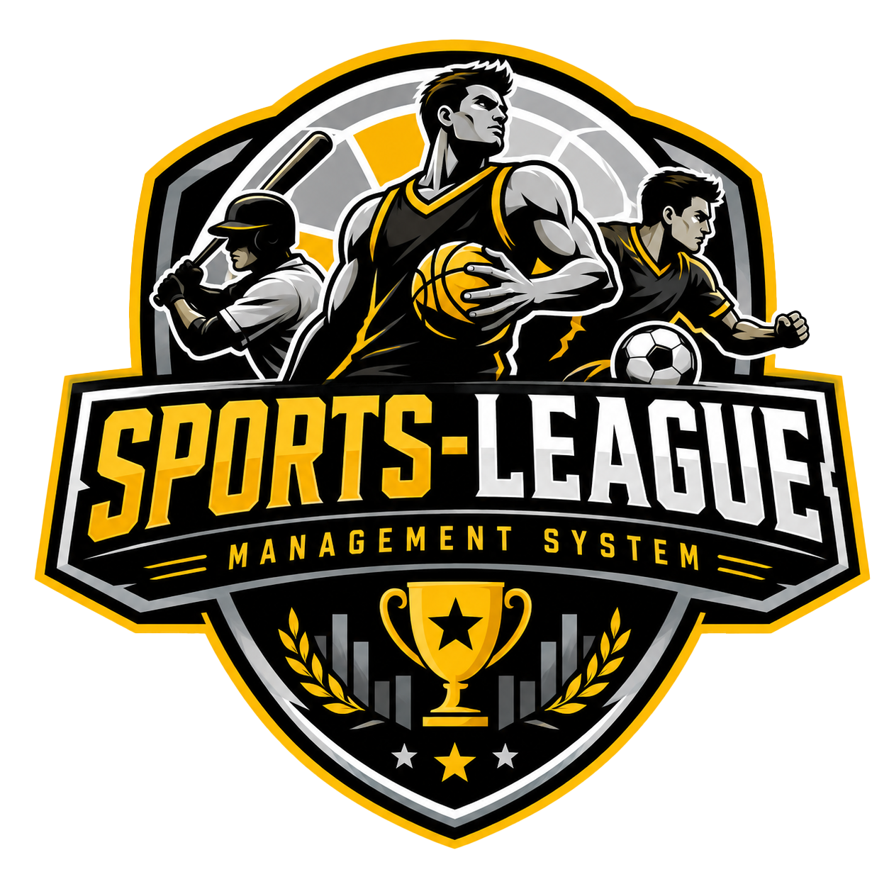

# Sports League Management System (Proyecto Final)

> **Sistema Distribuido de Gestion de Ligas Deportivas** desarrollado bajo principios estrictos de **Clean Architecture**, **Programacion Orientada a Objetos (POO)**, backend en **ASP.NET Core Web API (.NET 9)** con **Entity Framework Core**, y frontend moderno en **Blazor WebAssembly**.

---

<div align="center">
  
  <br />
  <p><strong>Plataforma Integral para la Administracion de Franquicias, Plantillas de Jugadores y Calendario Oficial de Encuentros Deportivos</strong></p>
</div>

---

## Tabla de Contenidos
1. [Descripcion General](#descripcion-general)
2. [Estructura de la Solucion (Clean Architecture)](#estructura-de-la-solucion-clean-architecture)
3. [Pilares de Programacion Orientada a Objetos (POO)](#pilares-de-programacion-orientada-a-objetos-poo)
4. [Modulos del Sistema](#modulos-del-sistema)
5. [Diseno UI/UX y Paleta Tematica](#diseno-uiux-y-paleta-tematica)
6. [Pila Tecnologica](#pila-tecnologica)
7. [Endpoints de la API (RESTful)](#endpoints-de-la-api-restful)
8. [Instrucciones de Ejecucion](#instrucciones-de-ejecucion)

---

## Descripcion General

El **Sports League Management System** es una solucion de software empresarial distribuida y de una sola pagina (**SPA**) disenada para centralizar las operaciones de una liga deportiva:
- **Administracion de Franquicias:** Registro y control de franquicias y ciudades sedes.
- **Plantillas Deportivas:** Gestion de jugadores, asignacion de posiciones en el campo y transferencias entre equipos.
- **Calendario Oficial y Marcadores en Vivo:** Programacion de encuentros, actualizacion en tiempo real de marcadores y seguimiento de estados (*Programado*, *En Curso*, *Finalizado*, *Cancelado*).
- **Dashboard Analitico:** Indicadores clave de rendimiento (KPIs), acceso rapido y visualizacion de proximos partidos.

---

## Estructura de la Solucion (Clean Architecture)

El proyecto esta desacoplado en **cinco capas independientes** dentro de la solucion `SportsLeague.sln`:

```text
Proyecto Final/
|
|-- SportsLeague.Domain/              # Capa de Dominio (Nucleo)
|   |-- Core/
|   |   `-- BaseEntity.cs             # Clase base abstracta obligatoria
|   |-- Entities/
|   |   |-- Team.cs                   # Entidad con sobrecargas de constructores y metodos
|   |   |-- Player.cs                 # Entidad con sobrecargas y navegacion
|   |   `-- Match.cs                  # Entidad de partidos con polimorfismo
|   `-- Interfaces/
|       |-- IBaseRepository.cs        # Contrato generico abstracto de repositorios
|       |-- ITeamRepository.cs
|       |-- IPlayerRepository.cs
|       `-- IMatchRepository.cs
|
|-- SportsLeague.Infrastructure/      # Capa de Infraestructura (Persistencia)
|   |-- Context/
|   |   `-- ApplicationDbContext.cs   # Contexto EF Core y mapeo de relaciones
|   |-- Core/
|   |   `-- BaseRepository.cs         # Clase abstracta base generica de repositorios
|   `-- Repositories/
|       |-- TeamRepository.cs
|       |-- PlayerRepository.cs
|       `-- MatchRepository.cs
|
|-- SportsLeague.Application/         # Capa de Servicios y Casos de Uso
|   |-- Contract/
|   |   |-- ITeamService.cs
|   |   |-- IPlayerService.cs
|   |   `-- IMatchService.cs
|   |-- Dtos/
|   |   |-- TeamDto.cs                # DTOs con validaciones DataAnnotations y sobrecargas
|   |   |-- PlayerDto.cs
|   |   `-- MatchDto.cs
|   `-- Services/
|       |-- TeamService.cs            # Logica de negocio y sobrecargas de metodos
|       |-- PlayerService.cs
|       `-- MatchService.cs
|
|-- SportsLeagueApi/                  # Capa de Presentacion Backend (API REST)
|   |-- Controllers/
|   |   |-- TeamsController.cs        # Endpoints REST documentados con Swagger
|   |   |-- PlayersController.cs
|   |   `-- MatchesController.cs
|   `-- Program.cs                    # Inyeccion de dependencias, CORS y sembrado de BD
|
`-- SportsLeague.WebAssembly/         # Capa de Frontend (Blazor SPA)
    |-- Layout/
    |   |-- MainLayout.razor          # Layout maestro con sidebar fija y topbar
    |   `-- NavMenu.razor             # Menu lateral interactivo con logo oficial
    |-- Pages/
    |   |-- Home.razor                # Dashboard con KPIs y proximos encuentros
    |   |-- Teams/                    # Listado y detalle modal de equipos
    |   |-- Players/                  # Listado y transferencia modal de jugadores
    |   |-- Matches/                  # Calendario, marcadores deportivos y filtros
    |   `-- Architecture/             # Visor interactivo de ajustes de POO
    |-- Shared/                       # Componentes reutilizables (Toast, ConfirmModal, StatCard)
    `-- Services/
        `-- SportsLeagueApiService.cs # Consumo HTTP tipado con tolerancia a fallos
```

---

## Pilares de Programacion Orientada a Objetos (POO)

El proyecto cumple de forma estricta con los siguientes conceptos avanzados de POO:

### 1. Clases Abstractas Obligatorias
- **`BaseEntity`:** Clase base abstracta de la cual heredan `Team`, `Player` y `Match`. Define el identificador univoco `Id`, el metodo abstracto obligatorio `GetEntitySummary()` y el metodo virtual `GetDisplayInfo()`.
- **`BaseRepository<T>`:** Clase base abstracta generica que implementa `IBaseRepository<T>` y centraliza las operaciones CRUD asincronas con Entity Framework Core.

### 2. Sobrecarga de Constructores (Constructor Overloading)
- **`Team`:** Constructor por defecto, constructor con `(name, city)` y constructor completo con `(id, name, city)`.
- **`Player`:** Constructor por defecto, constructor con `(fullName, position, teamId)` y constructor completo con `(id, fullName, position, teamId)`.
- **`Match`:** Constructor por defecto, constructor basico de programacion y constructor completo con marcadores.
- **DTOs (`TeamDto`, `PlayerDto`, `MatchDto`):** Sobrecargas de constructores para facilitar el mapeo bidireccional y pruebas unitarias.

### 3. Sobrecarga de Metodos (Method Overloading)
- **`Team.AddPlayer`:** Sobrecarga 1 (recibe objeto `Player`), Sobrecarga 2 (recibe `string fullName, string position`).
- **`Player.UpdateInfo`:** Sobrecarga 1 (actualiza datos sin transferir), Sobrecarga 2 (actualiza y transfiere a nuevo `teamId`).
- **`Match.UpdateResult`:** Sobrecarga 1 (actualiza marcador y finaliza), Sobrecarga 2 (actualiza marcador con estado explicito).
- **Servicios (`TeamService`, `PlayerService`, `MatchService`):** Metodos de consulta sobrecargados con filtros opcionales de texto, estado y pertenencia.

---

## Modulos del Sistema

1. **Dashboard Principal (`/`):** Metricas KPI en tiempo real (Equipos, Jugadores, Partidos, Ciudades Sedes), vista rapida de encuentros recientes y tablas de franquicias.
2. **Equipos (`/teams`):** Visualizacion en tarjetas interactivas, busqueda en tiempo real por ciudad, modal de creacion/edicion y modal de eliminacion con proteccion de integridad.
3. **Detalle de Franquicia (`/teams/{id}`):** Informacion tecnica del equipo, ciudad sede, plantilla completa de jugadores asociados y acciones rapidas.
4. **Jugadores (`/players`):** Catalogo de atletas, filtro por equipo, asignacion de posiciones deportivas, creacion, edicion y modal de confirmacion.
5. **Calendario y Marcadores (`/matches`):** Tarjetas de marcador estilo Scoreboard (Local vs Visitante), fecha/hora, estadio, pildoras de filtro (*Todos*, *Programados*, *En Vivo*, *Finalizados*, *Cancelados*), modal de programacion y modal rapido de actualizacion de marcador.
6. **Explorador de Arquitectura POO (`/oop-architecture`):** Documentacion interactiva en vivo dentro de la aplicacion que explica las clases abstractas y sobrecargas implementadas.

---

## Diseno UI/UX y Paleta Tematica

La interfaz de usuario fue disenada para transmitir energia, dinamismo y profesionalismo deportivo:

| Elemento | Codigo HEX | Rol en el Sistema |
| :--- | :---: | :--- |
| **Amarillo Primario** | `#FFB800` | Acentos, botones de accion primaria, badges activos e iconos destacados. |
| **Negro Profundo** | `#090A0F` | Fondo principal de la aplicacion (*Dark Theme*). |
| **Superficie de Tarjetas** | `#141721` / `#1A1D27` | Fondos de contenedores, paneles laterales y modales. |
| **Gris Bordes / Acento** | `#262B38` | Bordes suaves, divisores y badges neutros. |
| **Blanco Nieve** | `#FFFFFF` | Textos de encabezados, titulos y tipografia de alto contraste. |

- **Microinteracciones:** Efectos de elevacion (`translateY(-4px)`), resplandores dorados suaves (`box-shadow`), transiciones de 0.25s y animacion de pulso para partidos en vivo.

---

## Pila Tecnologica

- **Lenguaje:** C# 13 / .NET 9.0
- **Backend:** ASP.NET Core Web API 9.0, Entity Framework Core 9.0
- **Base de Datos:** Microsoft SQL Server (LocalDB)
- **Documentacion API:** Swagger / OpenAPI UI
- **Frontend:** Blazor WebAssembly Standalone (.NET 9.0)
- **Estilos:** CSS3 personalizado, Bootstrap Grid 5.3, Bootstrap Icons 1.11

---

## Endpoints de la API (RESTful)

### Equipos (`/api/teams`)
- `GET /api/teams` - Listar todos los equipos (con filtro opcional `?city=...`).
- `GET /api/teams/{id}` - Obtener detalle de un equipo.
- `POST /api/teams` - Registrar un nuevo equipo.
- `PUT /api/teams/{id}` - Actualizar datos de un equipo.
- `DELETE /api/teams/{id}` - Eliminar un equipo.

### Jugadores (`/api/players`)
- `GET /api/players` - Listar todos los jugadores (con filtro opcional `?teamId=...`).
- `GET /api/players/{id}` - Obtener un jugador por ID.
- `POST /api/players` - Registrar un nuevo jugador.
- `PUT /api/players/{id}` - Actualizar o transferir un jugador.
- `DELETE /api/players/{id}` - Eliminar un jugador.

### Partidos y Calendario (`/api/matches`)
- `GET /api/matches` - Listar encuentros (filtros `?status=...` y `?teamId=...`).
- `GET /api/matches/{id}` - Obtener detalle de un partido.
- `POST /api/matches` - Programar un nuevo partido.
- `PUT /api/matches/{id}` - Actualizar datos o marcadores de un partido.
- `DELETE /api/matches/{id}` - Eliminar un partido del calendario.

---

## Instrucciones de Ejecucion

### Desde Visual Studio 2022 / 2025:
1. Abre el archivo de solucion `SportsLeague.sln` ubicado en la carpeta `Proyecto Final`.
2. Haz clic derecho sobre la solucion -> **Establecer proyectos de inicio...**
3. Selecciona **Proyectos de inicio multiples**:
   - `SportsLeagueApi` -> **Iniciar**
   - `SportsLeague.WebAssembly` -> **Iniciar**
4. Presiona **`F5`** (o el boton verde **Iniciar**).
5. La base de datos SQL Server se inicializara y sembrara automaticamente con franquicias, atletas y partidos de ejemplo.

